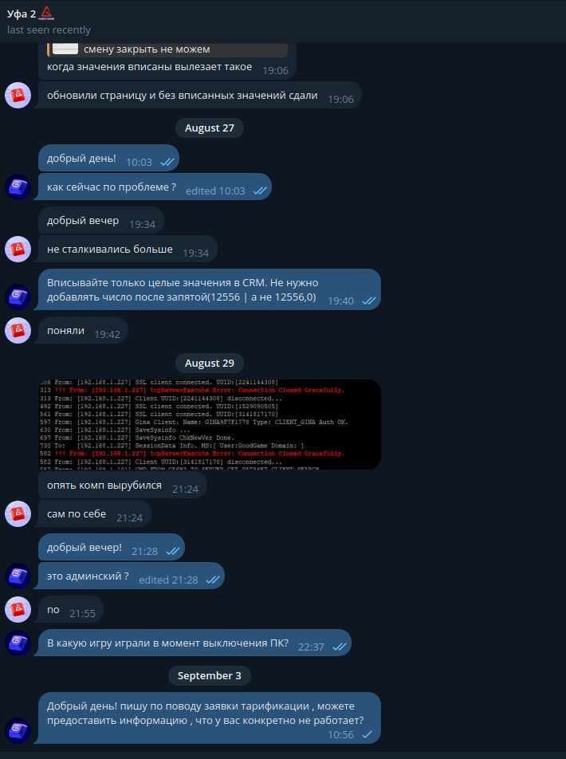

# Club tarrif repot 
## UFA2
**Взял задачу в Asana**
https://app.asana.com/1/1200441054237613/project/1208511070574346/task/1211163765505451?focus=true

**Связался с администратором клуба** 

  * После ответа, перешли к решению самой проблемы

**Попросил скинуть актуальный прайс для статуса GIRL**

  * После того как скинули актуальный прайс , перешел в программу **Asta Boss** и начал выполнять работу , проверки ценновой политики по актуальному прайс листу

**При проверки обноружел несоответсвие по ценновой политике клуба**
  * Проблема была в часовой посадке статуса **GIRL** по ценновой политике клуба

  * так же была проблема с несоответствием времени посадки
    * изначально было проставленно с **16:00-2:00** и с **2:00-16:00** 
**Исправлено** на **13:00-2:00** и **2:00-13:00**

* Так же проверили **3-х и 5-ти часовые пакеты** 
  * После чего подтвердили выполнение работ и закрыли заявку 
   